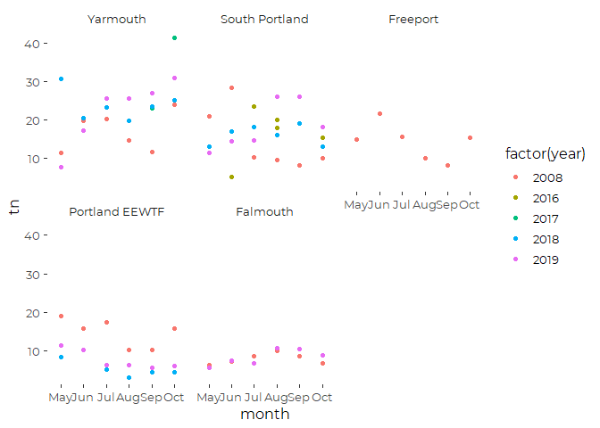

Casco Bay WWTF Discharges 2016 through 2018
================
Curtis C. Bohlen, Casco Bay Estuary Partnership.
04/26/2021

-   [Read Data](#read-data)
    -   [Folder References](#folder-references)
    -   [Load Data](#load-data)
        -   [Examine Data](#examine-data)
        -   [Correct Error](#correct-error)
    -   [Filter to Primary Facilities](#filter-to-primary-facilities)
    -   [Does Year Matter?](#does-year-matter)
    -   [Look at Portland Data](#look-at-portland-data)
-   [Calculate “Typical”
    Concentrations](#calculate-typical-concentrations)
    -   [Assemble Summary Tibble](#assemble-summary-tibble)
    -   [Add Alternate East End Values](#add-alternate-east-end-values)
        -   [Calculate Weighted Sum](#calculate-weighted-sum)
        -   [Add Row to Data](#add-row-to-data)
-   [Save Annual Average TN
    Concetrations](#save-annual-average-tn-concetrations)


\#Load libraries

``` r
library(readxl)
library(tidyverse)
#> Warning: package 'tidyverse' was built under R version 4.0.5
#> -- Attaching packages --------------------------------------- tidyverse 1.3.1 --
#> v ggplot2 3.3.3     v purrr   0.3.4
#> v tibble  3.1.2     v dplyr   1.0.6
#> v tidyr   1.1.3     v stringr 1.4.0
#> v readr   1.4.0     v forcats 0.5.1
#> Warning: package 'tidyr' was built under R version 4.0.5
#> Warning: package 'dplyr' was built under R version 4.0.5
#> Warning: package 'forcats' was built under R version 4.0.5
#> -- Conflicts ------------------------------------------ tidyverse_conflicts() --
#> x dplyr::filter() masks stats::filter()
#> x dplyr::lag()    masks stats::lag()


library(CBEPgraphics)
load_cbep_fonts()
theme_set(theme_cbep())
```

# Read Data

## Folder References

``` r
sibfldnm <- 'Original_Data'
parent <- dirname(getwd())
sibling <- file.path(parent,sibfldnm)

#dir.create(file.path(getwd(), 'figures'), showWarnings = FALSE)
```

## Load Data

``` r
fn <- "Curtis Bohlen 043021.xlsx"

the_data <- read_excel(file.path(sibling, fn), sheet = 'QC final') %>%
  rename(Site = `Site ID`,
         dt = Date,
         nox = `Nitrate+Nitrite As N (MG/L)`,
         tkn = `TKN (MG/L)`,
         tn = `TN (CALC) (MG/L)`,
         op = `Orthophosphate as P (MG/L)`,
         tp = `TP (DIRECT) (MG/L)`) %>%
  
    
  # We have some non-detects for TKN
  mutate(tkn_val = as.numeric(tkn),
         tkn_flag = grepl('<', tkn)) %>%
  mutate(tkn_val = if_else(tkn_flag,
                           as.numeric(substr(tkn, 2, nchar(tkn))),
                           tkn_val)) %>%
  rename(tkn_txt = tkn) %>%
  
  select(-op, -tp) %>%
  mutate(Site = fct_recode(Site,
                           Falmouth         = "FALMOUTH WWTP",
                           Freeport         = "FREEPORT WWTP",
                           `Portland EEWTF` = "PWD EAST END",
                           Westbrook        = "PWD WESTBROOK",
                           `South Portland` = "SOUTH PORTLAND WPCF",
                           Yarmouth         = "YARMOUTH WWTP")) %>%
  mutate(dt = as.Date(dt),
         month = as.numeric(format(dt, format = '%m')),
         month = factor(month, levels = 1:12, labels = month.abb),
         year =  as.numeric(format(dt, format = '%Y')),
         Site = factor(Site),
         Site = fct_reorder(Site, tn, .desc = TRUE)) %>%
  select(-tkn_txt) %>%
  relocate(month, year, .after = dt) 
#> Warning in mask$eval_all_mutate(quo): NAs introduced by coercion
```

### Examine Data

#### Does TN match sum of constituents?

TN values are USUALLY, but not ALWAYS equal to the sum of TKN and NOx
within rounding. There is really only one truly awkward record, with a
TN value of 26 that does not match the sum, even approximately. That is
from South Portland WWTF, 9/30/2019.

``` r
the_data %>%
  select(dt, tkn_val, tn, nox) %>%
  mutate(check = (tn - (tkn_val + nox)) < 0.1) %>%
  arrange(check) %>%
  head()
#> # A tibble: 6 x 5
#>   dt         tkn_val    tn   nox check
#>   <date>       <dbl> <dbl> <dbl> <lgl>
#> 1 2018-05-31    10    13     2.2 FALSE
#> 2 2018-10-31     7.7  13     5.1 FALSE
#> 3 2019-09-30    16    26     2.2 FALSE
#> 4 2008-05-13     2.5   6.3   3.8 TRUE 
#> 5 2008-06-25     2.3   7.3   5   TRUE 
#> 6 2008-07-16     3.1   8.5   5.4 TRUE
```

In an e-mail exchange with Angie Brewer of Maine DEP, May 6, 2021, she
confirms that this was a transcription error, and the correct TN value
should be 18.49.

### Correct Error

``` r
the_data <- the_data %>% 
  mutate(tn = if_else(Site == 'South Portland WPCF' & 
                        month == 'Sep' & 
                        year == 2019,
                      18.49, tn))
```

#### What years were data collected?

We are not interested (here) in the Sea Meadows, Cape Elizabeth, Peaks
Island, or Westbrook plants. They are small plants, for which we lack
discharge data, or in the case of Westbrook, they discharge into a
tributary, so N will be counted as part of the tributary load.

``` r
xtabs(~ year + month + Site, data = the_data,
      drop.unused.levels = TRUE)
#> , , Site = YARMOUTH SEA MEADOWS
#> 
#>       month
#> year   May Jun Jul Aug Sep Oct
#>   2008   0   0   0   0   0   0
#>   2016   0   0   0   0   0   0
#>   2017   0   0   0   1   1   1
#>   2018   0   0   0   0   0   0
#>   2019   0   0   0   0   0   0
#> 
#> , , Site = Yarmouth
#> 
#>       month
#> year   May Jun Jul Aug Sep Oct
#>   2008   1   1   1   1   1   1
#>   2016   0   0   0   0   0   0
#>   2017   0   0   0   0   1   1
#>   2018   1   1   1   1   1   1
#>   2019   1   1   1   1   1   1
#> 
#> , , Site = South Portland
#> 
#>       month
#> year   May Jun Jul Aug Sep Oct
#>   2008   1   1   1   1   1   1
#>   2016   0   1   1   2   0   1
#>   2017   0   0   0   0   0   0
#>   2018   1   1   1   1   1   1
#>   2019   1   1   1   1   1   1
#> 
#> , , Site = Freeport
#> 
#>       month
#> year   May Jun Jul Aug Sep Oct
#>   2008   1   1   1   1   1   1
#>   2016   0   0   0   0   0   0
#>   2017   0   0   0   0   0   0
#>   2018   0   0   0   0   0   0
#>   2019   0   0   0   0   0   0
#> 
#> , , Site = Portland EEWTF
#> 
#>       month
#> year   May Jun Jul Aug Sep Oct
#>   2008   1   1   1   1   1   1
#>   2016   0   0   0   0   0   0
#>   2017   0   0   0   0   0   0
#>   2018   1   1   1   1   1   1
#>   2019   1   1   1   1   1   1
#> 
#> , , Site = Falmouth
#> 
#>       month
#> year   May Jun Jul Aug Sep Oct
#>   2008   1   1   1   1   1   1
#>   2016   0   0   0   0   0   0
#>   2017   0   0   0   0   0   0
#>   2018   0   0   0   0   0   0
#>   2019   1   1   1   1   1   1
#> 
#> , , Site = PWD CAPE ELIZABETH
#> 
#>       month
#> year   May Jun Jul Aug Sep Oct
#>   2008   0   0   0   0   0   0
#>   2016   0   0   0   0   0   0
#>   2017   1   1   1   1   1   1
#>   2018   0   0   0   0   0   0
#>   2019   0   0   0   0   0   0
#> 
#> , , Site = PWD PEAKS ISLAND
#> 
#>       month
#> year   May Jun Jul Aug Sep Oct
#>   2008   0   0   0   0   0   0
#>   2016   0   0   0   0   0   0
#>   2017   0   0   0   0   0   0
#>   2018   1   1   1   1   1   1
#>   2019   1   1   1   1   1   1
#> 
#> , , Site = Westbrook
#> 
#>       month
#> year   May Jun Jul Aug Sep Oct
#>   2008   1   1   1   1   1   1
#>   2016   0   0   0   0   0   0
#>   2017   0   0   0   0   0   0
#>   2018   0   0   0   0   0   0
#>   2019   0   0   0   0   0   0
```

We see only a single possible duplicate – South Portland, August 2016.
But that turns out to NOT be a true duplicate. Both values are present
with exactly those dates, in both source data files. We leave the values
unchanged, but note that it may affect allocation of data to months,
since one is early August, the other late august, and there is no
equivalent September 2016 sample.

``` r
the_data %>%
  filter(Site == 'South Portland', year == 2016, month == 'Aug')
#> # A tibble: 2 x 8
#>   Site           dt         month  year   nox    tn tkn_val tkn_flag
#>   <fct>          <date>     <fct> <dbl> <dbl> <dbl>   <dbl> <lgl>   
#> 1 South Portland 2016-08-02 Aug    2016  7.33  17.9   10.6  FALSE   
#> 2 South Portland 2016-08-30 Aug    2016 11.1   19.9    8.83 FALSE
```

## Filter to Primary Facilities

``` r
the_data <- the_data %>%
  filter(Site %in% 
        c('Falmouth',  
          'Freeport',   
          'Portland EEWTF',
          'South Portland',
          'Yarmouth')) %>%
  mutate(Site = factor(Site))
```

## Does Year Matter?

``` r
  ggplot(the_data, aes(month, tn, color = factor(year))) + 
  geom_point() +
  facet_wrap(~ Site) +
  theme_cbep(base_size = 12)
```


For most sites, there is no evidence that discharge concentrations
differ by year. The exceptions are Yarmouth, where concentrations may
have increased, and East End, where they a have clearly decreased. We
can formalize that quick assessment with linear models.

``` r
lms <- 
  the_data %>%
  filter(Site %in% c('Falmouth',  
          'Portland EEWTF',
          'South Portland',
          'Yarmouth')) %>%
  group_by(Site) %>%
  nest() %>%
  mutate(lms = map(data, function(.x) lm(tn ~ factor(year), data = .x)))
  names(lms$lms) <- lms$Site
map(lms$lms, anova)
#> $Falmouth
#> Analysis of Variance Table
#> 
#> Response: tn
#>              Df  Sum Sq Mean Sq F value Pr(>F)
#> factor(year)  1  0.4408 0.44083  0.1432  0.713
#> Residuals    10 30.7883 3.07883               
#> 
#> $`Portland EEWTF`
#> Analysis of Variance Table
#> 
#> Response: tn
#>              Df Sum Sq Mean Sq F value    Pr(>F)    
#> factor(year)  2 265.37 132.687  14.505 0.0003119 ***
#> Residuals    15 137.22   9.148                      
#> ---
#> Signif. codes:  0 '***' 0.001 '**' 0.01 '*' 0.05 '.' 0.1 ' ' 1
#> 
#> $`South Portland`
#> Analysis of Variance Table
#> 
#> Response: tn
#>              Df Sum Sq Mean Sq F value Pr(>F)
#> factor(year)  3  47.67  15.889  0.3995 0.7549
#> Residuals    19 755.70  39.774               
#> 
#> $Yarmouth
#> Analysis of Variance Table
#> 
#> Response: tn
#>              Df Sum Sq Mean Sq F value  Pr(>F)  
#> factor(year)  3 382.21 127.403  2.7779 0.07498 .
#> Residuals    16 733.82  45.864                  
#> ---
#> Signif. codes:  0 '***' 0.001 '**' 0.01 '*' 0.05 '.' 0.1 ' ' 1
rm(lms)
```

## Look at Portland Data

A primary reason for requesting updated data from Maine DEP was because
the Portland Water District invested in nitrogen optimization technology
in 2017, and the older data we had did not consider reductions in
discharges that has made possible.

Those investments clearly led to significant reductions in discharges.

# Calculate “Typical” Concentrations

In preliminary review, we found standard deviations scale with medians
and means. There is little difference in these data between medians and
means. Since we are adding up totals, we prefer the means, because
calculating the mean is a linear function, so a sum of means is the mean
of sums.

## Assemble Summary Tibble

``` r
sum_tn <- the_data %>% 
  group_by(Site) %>%
  summarize(tn_n = sum(! is.na(tn)),
            tn_mn = mean(tn, na.rm = TRUE),
            tn_sd = sd(tn, na.rm = TRUE),
            tn_se = tn_sd / sqrt(tn_n)) %>%
  filter(Site %in% 
           c('Falmouth',  
             'Freeport',   
             'Portland EEWTF',
             'South Portland',
             'Yarmouth'))
```

## Add Alternate East End Values

We need to address the fact that our data on East End WWTF concentration
data is from summer months only. We plan to use our estimates of
nitrogen concentrations to estimate annual loading. That’s a problem.

The challenge is that PWD runs nitrogen optimization seasonally, because
the process depends on warm water to allow bacterial action. No nitrogen
optimization occurs in winter months (generally, November through mid
May).

As a result, summer discharges are not representative of year-round
discharges.  
but we only have data from summer months, because those are the months
with nutrient limitations in the EEWTF permit.

Given available data, we have three reasonable direct estimates of East
End annual average monthly concentrations:

1.  An average based only on recent (2018 and 2019) data. This will
    underestimate annual loading, because summer concentrations are
    substantially lower than winter concentrations

2.  An average based on all available data, from three years (2008, 2018
    2019). If the 2008 data represents “typical” discharge
    concentrations in the absence of nitrogen optimization, this average
    effectively weights summer (reduced concentration) values (from 2018
    and 2019) twice as heavily as our best estimate of winter (higher
    concentration) values (from 2008 data).

3.  A weighted average, in which we weight the 2008 data twice as
    heavily as we weight the more recent data. This correctly applies
    our “best guess” winter concentration estimate – from 2008 – and our
    “best guess” summer discharge concentrations – from 2018 and 2019 –
    equally. This provides a better estimate of winter + summer
    discharges.

As an alternative, we could also calculate discharges on a monthly
(rather than annual) basis, applying monthly summer average
concentrations from 2018 and 2019, and winter average concentrations
(either averaged, or month-by-month) from 2008. Perhaps a Monte Carlo
procedure could allow estimation of precision too. However, all this
added complexity would little alter annual load estimates. Besides, that
approach makes less sense for other plants, where we have no clear
evidence of seasonal changes in concentrations.

We believe option \# 3 provides the best summary of annual discharges,
but that choice is not the only reasonable one available to us. This is
not a purely statistical choice, but is based on our understanding of
EEWTF operations.

### Calculate Weighted Sum

First, we calculate mean values for each group.

``` r
alt_data <- the_data %>%
  filter(Site == 'Portland EEWTF') %>%
  mutate(was_2008 = year == 2008) %>%

  # 
  group_by(was_2008) %>%
  summarize(tn_n = sum(! is.na(tn)),
            tn_mn = mean(tn, na.rm = TRUE),
            tn_var = var(tn, na.rm = TRUE) / tn_n,
            .groups = 'drop')
alt_data
#> # A tibble: 2 x 4
#>   was_2008  tn_n tn_mn tn_var
#>   <lgl>    <int> <dbl>  <dbl>
#> 1 FALSE       12  6.72  0.586
#> 2 TRUE         6 14.7   2.29
```

That clearly shows the value of PWD’s nitrogen optimization. Over the
months with available data, PWD has reduced TN discharges by 54.4
percent. That comparison is not entirely apt, however, as it includes
periods of time when nitrogen optimization is not possible, especially
in May.

Portland Water District reports higher net reductions due to nitrogen
optimization. The difference probably reflects the fact that our
estimate of current mean concentrations applies over the entire
monitoring season, and thus includes some periods when nitrogen
optimization did not occur.

#### Calculate Estimate and its Variance

Then we calculate a weighted mean of those averages and its variance.
Here we calculate the average of those averages, even though they are
based on different numbers of observations. We propagate the error,
using the general form of the variance of a linear combination of random
variables.

$$\\text {For } Y = \\sum\_{i=1}^{n}a\_iXi \\\\
\\bar{Y} = \\sum\_{i=1}^{n}a\_i \\bar{Xi} \\\\
\\sigma^2\_y = var(Y) = var(\\sum\_{i=1}^{n}a\_iXi) = 
\\sum\_{i=1}^{n}a\_i^2var(Xi) = \\sum\_{i=1}^{n}a\_i^2 \\sigma^2\_{X\_i}
$$

``` r
alt_data <- alt_data %>% 
  
  summarize(tn_n = sum(tn_n),
            tn_mn = sum(tn_mn/2),   
            tn_var = sum(tn_var/4),    # Variance of sum is sum of variances, 
                                       # but you have to square the linear coefficients
            tn_se = sqrt(tn_var))  %>%
  select(-tn_var) %>%
  mutate(Site = 'Portland EEWTF, Seasonally Weighted')
```

### Add Row to Data

``` r
sum_tn <- sum_tn %>%
 bind_rows(alt_data) 
```

# Save Annual Average TN Concetrations

``` r
write_csv(sum_tn, 'Annual_Summary_TN.csv')
```
