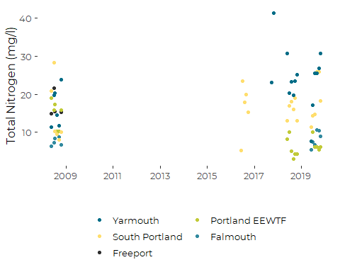
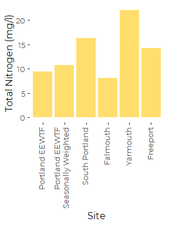
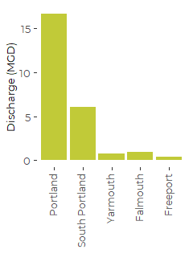
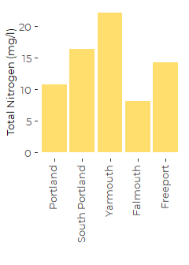
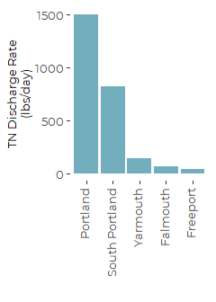
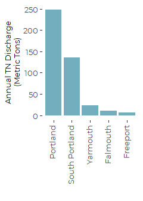
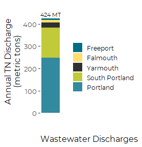
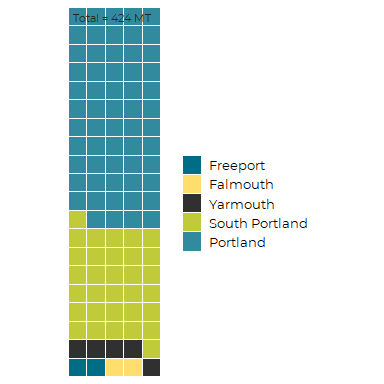

Casco Bay WWTF Discharges 2016 through 2018
================
Curtis C. Bohlen, Casco Bay Estuary Partnership.
04/26/2021

-   [Read Data](#read-data)
    -   [Folder References](#folder-references)
    -   [Load Raw Data](#load-raw-data)
        -   [Correct Error in Source
            Data](#correct-error-in-source-data)
    -   [Assemble Summary Tibble](#assemble-summary-tibble)
        -   [Add Alternate East End
            Values](#add-alternate-east-end-values)
-   [Load DEP Summary Data](#load-dep-summary-data)
-   [Combine Summary Data](#combine-summary-data)
    -   [Unit Conversions](#unit-conversions)
-   [Preliminary Plots](#preliminary-plots)
    -   [Timing of N Concentration
        Data](#timing-of-n-concentration-data)
        -   [TN Concentration](#tn-concentration)
    -   [Delete Unused Portland
        Estimator](#delete-unused-portland-estimator)
-   [Final Graphics](#final-graphics)
    -   [Daily Discharge](#daily-discharge)
    -   [TN Concentration](#tn-concentration-1)
    -   [TN Discharge - Daily, KG](#tn-discharge---daily-kg)
    -   [TN Discharges – Daily, Pounds](#tn-discharges--daily-pounds)
    -   [TN Discharges – Annual, Metric
        Tons](#tn-discharges--annual-metric-tons)
    -   [TN Loads, Annual, Metric Tons – Stacked
        Bar](#tn-loads-annual-metric-tons--stacked-bar)
        -   [Add Totals Annotation](#add-totals-annotation)
-   [Waffle Plot of WWTF Nitrogen](#waffle-plot-of-wwtf-nitrogen)


\#Load libraries

``` r
library(readxl)
library(tidyverse)
#> Warning: package 'tidyverse' was built under R version 4.0.5
#> -- Attaching packages --------------------------------------- tidyverse 1.3.1 --
#> v ggplot2 3.3.3     v purrr   0.3.4
#> v tibble  3.1.1     v dplyr   1.0.5
#> v tidyr   1.1.3     v stringr 1.4.0
#> v readr   1.4.0     v forcats 0.5.1
#> Warning: package 'tibble' was built under R version 4.0.5
#> Warning: package 'tidyr' was built under R version 4.0.5
#> Warning: package 'dplyr' was built under R version 4.0.5
#> Warning: package 'forcats' was built under R version 4.0.5
#> -- Conflicts ------------------------------------------ tidyverse_conflicts() --
#> x dplyr::filter() masks stats::filter()
#> x dplyr::lag()    masks stats::lag()

library(waffle)

library(CBEPgraphics)
load_cbep_fonts()
theme_set(theme_cbep())
```

# Read Data

## Folder References

``` r
sibfldnm <- 'Original_Data'
parent <- dirname(getwd())
sibling <- file.path(parent,sibfldnm)

dir.create(file.path(getwd(), 'figures'), showWarnings = FALSE)
```

## Load Raw Data

We have a handful of non-detects for TKN, so we need to read data in as
text and convert to numeric values, skipping the ‘&lt;’ sign included in
the data source. We add the `tkn_flag` variable to track which values
are non-detects. The impact in this setting (since we do not estimate
expected values of the non-detects because data is sparse) is that we
effectively replace non-detects with their detection limits, which will
slightly over estimate true nitrogen loads.

``` r
fn <- "Curtis Bohlen 043021.xlsx"

raw_data <- read_excel(file.path(sibling, fn), sheet = 'QC final') %>%
  rename(Site = `Site ID`,
         dt = Date,
         nox = `Nitrate+Nitrite As N (MG/L)`,
         tkn = `TKN (MG/L)`,
         tn = `TN (CALC) (MG/L)`,
         op = `Orthophosphate as P (MG/L)`,
         tp = `TP (DIRECT) (MG/L)`) %>%
  select(-op, -tp) %>%
 
  # Address non-detects
  mutate(tkn_val = as.numeric(tkn),
         tkn_flag = grepl('<', tkn)) %>%
  mutate(tkn_val = if_else(tkn_flag,
                           as.numeric(substr(tkn, 2, nchar(tkn))),
                           tkn_val)) %>%
  rename(tkn_txt = tkn) %>%
  

  mutate(Site = fct_recode(Site,
                           Falmouth         = "FALMOUTH WWTP",
                           Freeport         = "FREEPORT WWTP",
                           `Portland EEWTF` = "PWD EAST END",
                           Westbrook        = "PWD WESTBROOK",
                           `South Portland` = "SOUTH PORTLAND WPCF",
                           Yarmouth         = "YARMOUTH WWTP")) %>%
  mutate(dt = as.Date(dt),
         month = as.numeric(format(dt, format = '%m')),
         month = factor(month, levels = 1:12, labels = month.abb),
         year =  as.numeric(format(dt, format = '%Y')),
         Site = factor(Site),
         Site = fct_reorder(Site, tn, .desc = TRUE)) %>%
  select(-tkn_txt) %>%
  relocate(month, year, .after = dt) 
#> Warning in mask$eval_all_mutate(quo): NAs introduced by coercion
```

### Correct Error in Source Data

Angie Brewer of Maine DEP confirmed a transcription error in the data,
we correct that here.

``` r
raw_data <- raw_data %>% 
  mutate(tn = if_else(Site == 'South Portland WPCF' & 
                        month == 'Sep' & 
                        year == 2019,
                      18.49, tn))
```

## Assemble Summary Tibble

``` r
sum_tn <- raw_data %>% 
  group_by(Site) %>%
  summarize(tn_n = sum(! is.na(tn)),
            tn_mn = mean(tn, na.rm = TRUE),
            tn_sd = sd(tn, na.rm = TRUE),
            tn_se = tn_sd / sqrt(tn_n)) %>%
  filter(Site %in% 
           c('Falmouth',  
             'Freeport',   
             'Portland EEWTF',
             'South Portland',
             'Yarmouth'))
```

### Add Alternate East End Values

We need to address the fact that our data on East End WWTF concentration
data is from summer months only. We plan to use our estimates of
nitrogen concentrations to estimate annual loading. That’s a problem.

The challenge is that PWD runs nitrogen optimization seasonally, because
the process depends on warm water to allow bacterial action. No nitrogen
optimization occurs in winter months (generally, November through mid
May).

A weighted average, in which we weight the 2008 data twice as heavily as
we weight the more recent data correctly applies our “best guess” winter
concentration estimate (from 2008) to half the year and our “best guess”
summer discharge concentrations (from 2018 and 2019) to the other half
of the year.

#### Calculate Weighted Sum

First, we calculate mean values for each group. Note that summer
concentrations of TN at East End are now well under half what they were
in 2008.

``` r
alt_data <- raw_data %>%
  filter(Site == 'Portland EEWTF') %>%
  mutate(was_2008 = year == 2008) %>%

  group_by(was_2008) %>%
  summarize(tn_n = sum(! is.na(tn)),
            tn_mn = mean(tn, na.rm = TRUE),
            tn_var = var(tn, na.rm = TRUE) / tn_n,
            .groups = 'drop')
alt_data
#> # A tibble: 2 x 4
#>   was_2008  tn_n tn_mn tn_var
#>   <lgl>    <int> <dbl>  <dbl>
#> 1 FALSE       12  6.72  0.586
#> 2 TRUE         6 14.7   2.29
```

Portland Water District reports higher net reductions due to nitrogen
optimization. The difference probably reflects the fact that our
estimate of current mean concentrations applies over the entire
monitoring season , and thus includes some periods when nitrogen
optimization did not occur.

#### Calculate Estimate and its Variance

Then we calculate the average of those averages and its variance. The
two averages are based on different numbers of observations, so their
uncertainties differ. We propagate the error using the general form of
the variance of a linear combination of random variables.

$$
\\text {For } Y = \\sum\_{i=1}^{n}a\_iXi \\\\
\\bar{Y} = \\sum\_{i=1}^{n}a\_i \\bar{Xi} \\\\
\\sigma^2\_y = var(Y) = var(\\sum\_{i=1}^{n}a\_iXi) = 
\\sum\_{i=1}^{n}a\_i^2var(Xi) = \\sum\_{i=1}^{n}a\_i^2 \\sigma^2\_{X\_i}
$$
\#\#\#\# Combine Data

``` r
alt_data <- alt_data %>% 
  summarize(tn_n = sum(tn_n),
            tn_mn = sum(tn_mn/2),   
            tn_var = sum(tn_var/4),    # Variance of sum is sum of variances, 
                                       # but with a linear combination, you have 
                                       # to square the coefficients
            tn_se = sqrt(tn_var))  %>%
  select(-tn_var) %>%
  mutate(Site = 'Portland EEWTF\nSeasonally Weighted')
  
sum_tn <- sum_tn %>%
 bind_rows(alt_data)
rm(alt_data)
```

# Load DEP Summary Data

The Summary Tab in the original DEP excel spreadsheet includes data on
the SAPPI and Westbrook plants. Both discharge to the Presumpscot, so
related nutrient loads should be tracked via riverine inputs to the Bay.
Moreover, SAPPI is not a typical municipal WWTF, so arguably should not
be included anyway. We drop both plants.

We also note that the summary TN concentrations in the DEP summary data
are based on older (principally 2008) data, and have not been updated
with the newer information. We discard those data in favor of the
updated information assembled from the raw data.

``` r
discharge_data <- read_excel(file.path(sibling, fn), sheet = 'summary', n_max = 7,
                             col_types = c("text", 
                                           "skip", "skip", 
                                           "skip", "numeric", 
                                           "skip", "numeric", 
                                           "skip", "skip")) %>%
  rename(Site            = `SAMPLE_POINT_ID`,
         design_flow     = `DESIGN_FLOW_ MONTHLY_AVERAGE_2012-2016 (MGD)`,
         avg_flow        = `MONTHLY_ AVG_ FLOW_2012-2016 (MGD)`) %>%
  
 filter(Site %in% c('FREEPORT', 'FALMOUTH',
                    'YARMOUTH', 'SOUTH PORTLAND','PWD-EAST END'))
#> Warning in read_fun(path = enc2native(normalizePath(path)), sheet_i = sheet, :
#> Expecting numeric in E6 / R6C5: got 'Report'
#> Warning in read_fun(path = enc2native(normalizePath(path)), sheet_i = sheet, :
#> Expecting numeric in E8 / R8C5: got 'Report'

# Add a row for the supplementary estimate.
discharge_data[6,] <- discharge_data [5,]
discharge_data$Site[6] <- 'Portland EEWTF\nSeasonally Weighted'

# Clean up Names
discharge_data <- discharge_data %>%
 mutate(Site = fct_recode(Site, Freeport = 'FREEPORT',
                           Falmouth       = 'FALMOUTH',
                           Yarmouth       = 'YARMOUTH',
                           `South Portland` = 'SOUTH PORTLAND',
                           `Portland EEWTF` = 'PWD-EAST END'
                           ))
```

# Combine Summary Data

## Unit Conversions

$$ V = V( ^6

C = C

$$

*L*(*k**g*/*d**a**y*) = *C*(*k**g*/*l*) × *V*(*l*/*d**a**y*)=

$$ L (kg/day) = V( ^6 \\ C ^{-3} ^{-3}

$$

Note that the factors of 1000 cancel out, so in net:

tn\_load in kg / day = volume (MGD) \* 3.78541 \* concentration (mg/l)

tn\_load in pounds per day = volume \* 3.78541 (MGD) \* 2.20462 lb/kg \*
concentration (mg/l)

(Note that the calculations Angela Brewer prepared calculate loads in
pounds per day).

``` r
l_p_gal <- 3.78541
lb_p_kg <- 2.20462

combined_summary <- discharge_data %>%
  left_join(sum_tn, by = 'Site') %>%
  mutate(tn_load_at_design_kg = design_flow * tn_mn * l_p_gal,
         tn_load_at_design_lb = design_flow * tn_mn * l_p_gal * lb_p_kg,
         tn_load_avg_kg = avg_flow * tn_mn * l_p_gal,
         tn_load_avg_lb = avg_flow * tn_mn * l_p_gal * lb_p_kg,
         tn_load_avg_mtpy = tn_load_avg_kg * 365 / 1000)
```

# Preliminary Plots

## Timing of N Concentration Data

``` r
plt <-  raw_data %>%
    filter(Site %in% 
           c('Falmouth',  
             'Freeport',   
             'Portland EEWTF',
             'South Portland',
             'Yarmouth')) %>%
  ggplot(aes(dt, tn, color = Site)) + 
  geom_point() +
  scale_x_date(date_breaks = '2 years', date_labels = '%Y') +
  scale_color_manual(values = cbep_colors(), name = '') +
  theme_cbep(base_size = 12) +
  theme(legend.position = 'bottom', 
        legend.text = element_text(size = 10)) +
  guides(color = guide_legend(ncol = 2)) +
  ylab('Total Nitrogen (mg/l)') +
  xlab('')
plt
```


So about half of the Total Nitrogen data is from 2008. That is far from
up to date….

### TN Concentration

``` r
plt <-combined_summary %>%
  mutate(Site = fct_reorder(factor(Site), avg_flow, .desc = TRUE)) %>%
  ggplot(aes(Site, tn_mn)) + 
  geom_col(fill = cbep_colors()[2]) + 
  #scale_y_log10() + 
  ylab('Total Nitrogen (mg/l)')  +
  scale_color_manual(values = cbep_colors(), name = '') +
  theme_cbep(base_size = 12) +
  theme(legend.position = 'bottom', 
        axis.text.x= element_text(size = 10, angle =90, hjust = 1, vjust = 0.25))
plt
```


Note that selection of alternative estimates for average annual
concentration from East End changes out Portland estimate by 15% or so:

``` r
combined_summary$tn_mn[combined_summary$Site == 
                         'Portland EEWTF\nSeasonally Weighted'] /
combined_summary$tn_mn[combined_summary$Site == 
                         'Portland EEWTF']
#> [1] 1.142076
```

## Delete Unused Portland Estimator

For consistency and simplicity in our final graphics, we use the
seasonally weighted Portland estimate, and rename it.

``` r
combined_summary <- combined_summary %>%
  filter(Site != 'Portland EEWTF') %>%
  mutate(Site = if_else(Site == 'Portland EEWTF\nSeasonally Weighted',
                        'Portland',
                        as.character(Site))) %>%
  mutate(Site = fct_reorder(factor(Site), tn_load_avg_mtpy, .desc = TRUE))
```

# Final Graphics

## Daily Discharge

``` r
plt <- combined_summary %>%
  ggplot(aes(Site, avg_flow)) + 
  geom_col(fill = cbep_colors()[4]) + 
  #scale_y_log10() + 
  ylab('Discharge (MGD)')  +
  xlab('') +
  scale_color_manual(values = cbep_colors(), name = '') +
  theme_cbep(base_size = 12) +
  theme(legend.position = 'bottom', 
        axis.text.x= element_text(size = 9, angle =90, hjust = 1, vjust = 0.25),
        axis.title.y = element_text(size = 10))
plt
```



``` r
ggsave('figures/daily_discharges_five_sites.pdf', device = cairo_pdf, 
       width = 2.5, height = 3.5)
```

## TN Concentration

``` r
plt <-combined_summary %>%
  ggplot(aes(Site, tn_mn)) + 
  geom_col(fill = cbep_colors()[2]) + 
  #scale_y_log10() + 
  ylab('Total Nitrogen (mg/l)')  +
  xlab('') +
  scale_color_manual(values = cbep_colors(), name = '') +
  theme_cbep(base_size = 12) +
  theme(legend.position = 'bottom', 
        axis.text.x= element_text(size = 10, angle =90, hjust = 1, vjust = 0.25),
        axis.title.y= element_text(size = 10))
plt
```



``` r
ggsave('figures/average_tn.pdf', device = cairo_pdf, 
       width = 2.5, height = 3.5)
```

## TN Discharge - Daily, KG

``` r
plt <- combined_summary %>%
  ggplot(aes(Site, tn_load_avg_kg)) + 
  geom_col(fill = cbep_colors()[6]) + 
  
  #scale_y_log10() + 
  ylab('TN Discharge Rate\n (kg/day)')  +
  xlab('') +
  
  theme_cbep(base_size = 12) +
  theme(axis.text.x= element_text(angle = 90, vjust = 0.25, hjust = 1),,
        axis.title.y= element_text(size = 10))
plt
```


``` r
ggsave('figures/tn_discharges_kg.pdf', device = cairo_pdf, 
       width = 2.5, height = 3.5)
```

## TN Discharges – Daily, Pounds

``` r
plt <- combined_summary %>%

  ggplot(aes(Site, tn_load_avg_lb)) + 
  geom_col(fill = cbep_colors()[6]) + 
  
  #scale_y_log10() + 
  ylab('TN Discharge Rate\n(lbs/day)')  +
  xlab('') +
  
  theme_cbep(base_size = 12) +
  theme(axis.text.x= element_text(angle =90, hjust = 1, vjust = 0.25),
        axis.title.y= element_text(size = 10))
plt
```



``` r
ggsave('figures/tn_discharges_lbs.pdf', device = cairo_pdf, 
       width = 2.5, height = 3.5)
```

## TN Discharges – Annual, Metric Tons

``` r
plt <- combined_summary %>%

  ggplot(aes(Site, tn_load_avg_mtpy)) + 
  geom_col(fill = cbep_colors()[6]) + 
  
  #scale_y_log10() + 
  ylab('Annual TN Discharge\n(Metric Tons)')  +
  xlab('') +
  
  theme_cbep(base_size = 12) +
  theme(axis.text.x= element_text(angle =90, hjust = 1, vjust = 0.25),
        axis.title.y= element_text(size = 10))
plt
```



``` r
ggsave('figures/tn_discharges_annual.pdf', device = cairo_pdf, 
       width = 2.5, height = 3.5)
```

## TN Loads, Annual, Metric Tons – Stacked Bar

``` r
plt <- combined_summary %>%
  mutate(Site = fct_reorder(factor(Site), tn_load_avg_mtpy, .desc = FALSE)) %>%
  
  ggplot(aes(1, tn_load_avg_mtpy, fill = Site)) + 
  geom_col() + 
  
  #scale_y_log10() + 
  ylab('Annual TN Discharge\n(metric tons)')  +
  xlab('') +
  
  scale_fill_manual(values = cbep_colors(), name = '') +
  theme_cbep(base_size = 12) +
  theme(axis.text.x= element_blank(),
        axis.ticks.x = element_blank(),
        legend.key.size = unit(0.2, 'in'),
        legend.text = element_text(size = 9))
```

### Add Totals Annotation

``` r
total <- combined_summary %>%
  filter(Site != 'Portland EEWTF') %>%
  select(tn_load_avg_mtpy) %>%
  summarize(total = sum(tn_load_avg_mtpy)) %>%
  pull(total)


plt2 <- plt +
  ylim(0, 1.1 * total) +
  annotate('text', x = 1, y = 1.045 * total, 
            label = paste(round(total), 'MT'), 
            size = 3) +
  labs(caption = 'Wastewater Discharges')  +
  theme(plot.caption = element_text(hjust=0, size = 12))

plt2
```



``` r
ggsave('figures/annual_tn_loads.pdf', device = cairo_pdf, 
       width = 2.9, height = 3)
```

# Waffle Plot of WWTF Nitrogen

``` r
total <- combined_summary %>%
  filter(Site != 'Portland EEWTF') %>%
    summarize(total = sum(tn_load_avg_mtpy)) %>%
  pull(total)

waf_dat<-  combined_summary %>%
  filter(Site != 'Portland EEWTF') %>%
  mutate(Site = fct_reorder(factor(Site), tn_load_avg_mtpy, .desc = FALSE)) %>%
  select(Site, tn_load_avg_mtpy) %>%
  mutate(tn_pct = tn_load_avg_mtpy / total,
         tn_pct = tn_pct / sum(tn_pct))

(waf_vec <-  round(waf_dat$tn_pct,2))
#> [1] 0.02 0.02 0.05 0.32 0.58
# Roundin means that does not add to 100, and we need it to add to
# 100 to generate and "even" waffle grid, so we rescale by rounded
# totals.

tot <- sum(waf_vec)
(waf_vec_2 = round(waf_vec/tot,2))
#> [1] 0.02 0.02 0.05 0.32 0.59

names(waf_vec_2) = waf_dat$Site
```

``` r
waffle(waf_vec_2 * 100,                     # data
       colors=cbep_colors()[1:5],  # colors
       rows = 5,                    # row number 
       size = 0,
       legend_pos = 'right',
       flip = TRUE) +
  guides(fill =  guide_legend(nrow = 5)) +
  theme(legend.text = element_text(family = 'Montserrat', size = 10),
        legend.key.size = unit(.2, 'inch')) +
  annotate('text', size = 3, hjust = 0, color = 'gray15',
           x = 0.75, y = 20,
           label = paste('Total =', round(total), 'MT')) #+
```



``` r
  #labs(subtitle = "Annual Nitrogen Loads\nFrom Wastewater Facilities")

ggsave('figures/wwtf__waffle.pdf', device = cairo_pdf, width = 4, height = 4)
```
