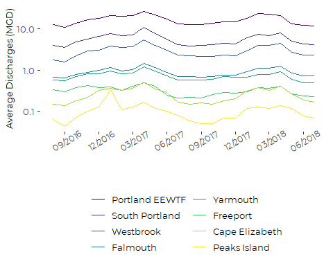
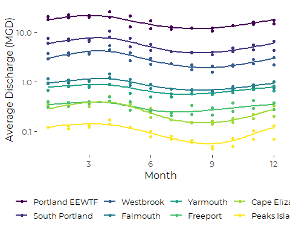
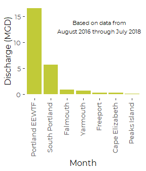
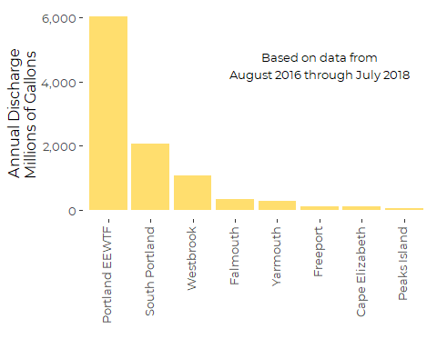

Casco Bay WWTF Discharges 2016 through 2018
================
Curtis C. Bohlen, Casco Bay Estuary Partnership.
04/26/2021

-   [Read Data](#read-data)
    -   [Folder References](#folder-references)
    -   [Load Data](#load-data)
    -   [Limit To Two Years of Data](#limit-to-two-years-of-data)
-   [Mean of Monthly Estimates of Daily
    Discharges](#mean-of-monthly-estimates-of-daily-discharges)
-   [Calculate Annual Totals](#calculate-annual-totals)
    -   [Related Graphic](#related-graphic)


\#Load libraries

``` r
library(readxl)
library(tidyverse)
#> Warning: package 'tidyverse' was built under R version 4.0.5
#> -- Attaching packages --------------------------------------- tidyverse 1.3.1 --
#> v ggplot2 3.3.3     v purrr   0.3.4
#> v tibble  3.1.2     v dplyr   1.0.6
#> v tidyr   1.1.3     v stringr 1.4.0
#> v readr   1.4.0     v forcats 0.5.1
#> Warning: package 'tidyr' was built under R version 4.0.5
#> Warning: package 'dplyr' was built under R version 4.0.5
#> Warning: package 'forcats' was built under R version 4.0.5
#> -- Conflicts ------------------------------------------ tidyverse_conflicts() --
#> x dplyr::filter() masks stats::filter()
#> x dplyr::lag()    masks stats::lag()

library(CBEPgraphics)
load_cbep_fonts()
theme_set(theme_cbep())
```

# Read Data

``` r
sibfldnm <- 'Derived_Data'
parent <- dirname(getwd())
sibling <- file.path(parent,sibfldnm)

dir.create(file.path(getwd(), 'figures'), showWarnings = FALSE)
```

## Folder References

## Load Data

``` r
fn <- "Total_Discharge_Volumes.xlsx"

the_data <- read_excel(file.path(sibling, fn), skip = 5,
                       col_types = c('text', 'date', 'numeric', 'numeric')) %>%
  rename(dt = `Report date`,
         Avg = `Average Daily`, 
         Max = `Max Daily`) %>%
  mutate(Site = if_else(Site == 'South Portland 001A', 'South Portland', Site)) %>%
  mutate(dt = as.Date(dt),
         month = as.numeric(format(dt, format = '%m')),
         month = factor(month, levels = 1:12, labels = month.abb),
         year =  as.numeric(format(dt, format = '%Y')),
         Site = factor(Site),
         Site = fct_reorder(Site, Avg, .desc = TRUE))
```

``` r
  unique(the_data$dt)
#>  [1] "2016-05-01" "2016-06-01" "2016-07-01" "2016-08-01" "2016-09-01"
#>  [6] "2016-10-01" "2016-11-01" "2016-12-01" "2017-01-01" "2017-02-01"
#> [11] "2017-03-01" "2017-04-01" "2017-05-01" "2017-06-01" "2017-07-01"
#> [16] "2017-08-01" "2017-09-01" "2017-10-01" "2017-11-01" "2017-12-01"
#> [21] "2018-01-01" "2018-02-01" "2018-03-01" "2018-04-01" "2018-05-01"
#> [26] "2018-06-01" "2018-07-01"
```

## Limit To Two Years of Data

``` r
the_data <- the_data %>%
  filter(dt > as.Date("2016-07-01"))
```

``` r
plt <- ggplot(the_data, aes(dt, Avg, color = Site)) + 
  geom_line() + 
  scale_y_log10() +
  scale_x_date(date_breaks = '3 months', date_labels = '%m/%Y') +
  scale_color_viridis_d(name = '') +
  theme_cbep(base_size = 12) +
  theme(legend.position = 'bottom', 
        legend.text = element_text(size = 10),
        axis.title.y = element_text(size = 10),
        axis.text.x = element_text(size = 9, angle = 30)) +
  guides(color = guide_legend(ncol = 2)) +
  ylab('Average Discharges (MGD)') +
  xlab('')

plt
```



``` r
plt <- ggplot(the_data) + 
  aes(as.numeric(month),Avg, color = Site) + 
  geom_point() + 
  geom_smooth(method = 'gam', 
              formula = y~ s(x, bs = 'cc'),  # Force periodic fits
              se = FALSE) + 
  scale_y_log10() + 
  scale_x_continuous(limits=c(1,12), breaks = c(3,6,9,12)) +
  xlab('Month') + 
  ylab('Average Discharge (MGD)')  +
  scale_color_viridis_d(name = '') +
  theme_cbep(base_size = 12) +
  theme(legend.position = 'bottom', 
        legend.text = element_text(size = 10))
plt
```



# Mean of Monthly Estimates of Daily Discharges

These are our calculated values based on data from PDFs of discharge
reports. Compare to the official DEP values in the Excel data provided
directly by Angie Brewer, which we used for calculating N loading. The
values do not quite match, but are similar.

``` r
the_data %>%
  group_by(Site) %>%
  summarize(MGD = mean(Avg, na.rm = TRUE))
#> # A tibble: 8 x 2
#>   Site              MGD
#>   <fct>           <dbl>
#> 1 Portland EEWTF 16.5  
#> 2 South Portland  5.67 
#> 3 Westbrook       2.94 
#> 4 Falmouth        0.898
#> 5 Yarmouth        0.724
#> 6 Freeport        0.322
#> 7 Cape Elizabeth  0.260
#> 8 Peaks Island    0.106
```

``` r
plt <- the_data %>%
  filter(Site != 'Westbrook') %>%
  ggplot(aes(Site, Avg)) + 
  stat_summary(geom = 'col', fill = cbep_colors()[4]) +
  # stat_summary(geom = 'linerange',
  #              fun.data = "mean_cl_normal",
  #              size = 1, col = cbep_colors()[3]) + 

  xlab('Month') + 
  ylab('Discharge (MGD)')  +

  theme_cbep(base_size = 12) +
  theme(legend.position = 'bottom', 
        legend.text = element_text(size = 10),
        axis.text.x = element_text(angle = 90, vjust = 0.25, hjust = 1)) +
  annotate("text", x = 5, y = 13,  size = 3,
            label = 'Based on data from\nAugust 2016 through July 2018')
plt
#> No summary function supplied, defaulting to `mean_se()`
```



``` r
ggsave('figures/daily_discharges.pdf', device = cairo_pdf, 
       width = 3, height = 3.5)
#> No summary function supplied, defaulting to `mean_se()`
```

# Calculate Annual Totals

Averaging over 24 Months:

``` r
monthdays <- c(31, 28, 31, 30,31,30, 31, 31, 30, 31, 30, 31)
tmp <- the_data %>% 
  mutate(MonthTot= Avg * monthdays[as.numeric(month)])
annual_data<- tmp %>% 
  select(Site, Avg, MonthTot) %>% 
  group_by(Site) %>% 
  summarise(Annual_Avg = sum(MonthTot, na.omit = TRUE)/2) %>%
  mutate(Site = fct_reorder(Site, Annual_Avg, .desc = TRUE))
rm(tmp)
```

### Related Graphic

``` r
ggplot(annual_data, aes(Site, Annual_Avg)) +
  geom_col(position = position_dodge(), fill = cbep_colors()[2]) +
  xlab('') + 
  ylab('Annual Discharge\nMillions of Gallons ')  +
  scale_y_continuous(labels = scales::comma_format()) +
  theme_cbep(base_size = 12) +
  theme(axis.text.x = element_text(angle = 90, vjust = 0.25, hjust = 1)) +
  annotate("text", x = 6, y = 4500,  size = 3.5,
            label = 'Based on data from\nAugust 2016 through July 2018')
```



``` r
ggsave('figures/annual_discharges.pdf', device = cairo_pdf, 
       width = 5, height = 4)
```
